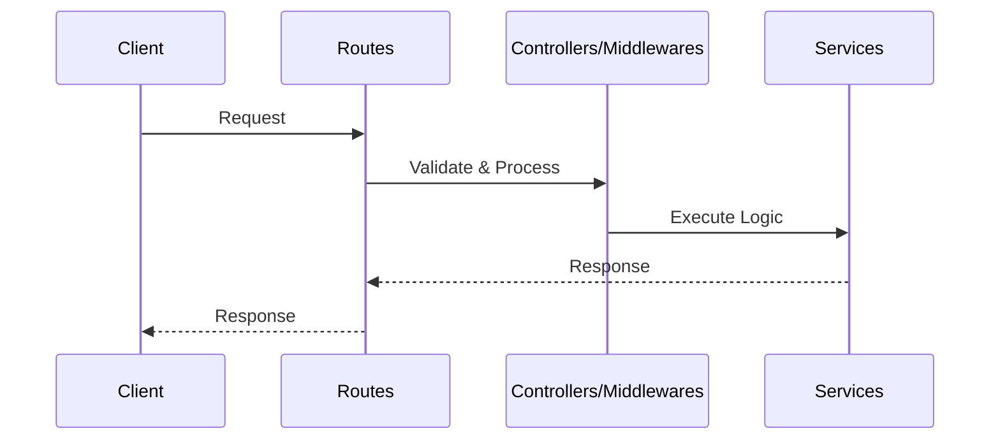

# File-Search Backend

This is the backend service for the File Search application.  
It handles file uploads, PDF parsing, and basic search functionality over the parsed content.

---

## ✨ Endpoints

- `POST /api/files/upload` – Uploads a PDF file, parses it, and stores the extracted content.
- `GET /api/search` – Searches for a keyword within the parsed text content.

---

## 🧱 Project Structure



---

## 📝 Notes

While the long-term plan is to integrate Supabase for PostgreSQL (text search) and file storage, this **first proof of concept (POC)** keeps things simple by:

- Parsing the PDF content using `pdf2json`
- Handling everything locally (no external DB or storage yet)

This approach helps validate the core functionality — uploading files and searching inside them — before adding infrastructure layers.

---

## 🚀 Getting Started (Backend Only)

### 📦 Dependencies

```json
"cors": "^2.8.5",
"dotenv": "^16.4.7",
"express": "^5.1.0",
"multer": "^1.4.5-lts.2",
"pdf2json": "^3.1.4",
"uuid": "^11.1.0"
```

> ✅ Make sure you have **Node.js v20+** installed.

### 🧾 Steps

1. Clone the repo and navigate to the backend folder
2. Run `npm install` to install dependencies
3. Run `npm run build` to compile TypeScript (if applicable)
4. Start the server:
   - `npm run dev` for development with hot reload
   - `npm start` for running the built version

---

That’s it! Your backend should now be running locally on `http://localhost:3000` (or your configured port).
